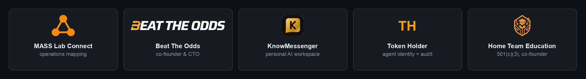

<h1 align="center">Mali Franzese</h1>

  <b>Founder-Engineer at The MASS Lab</b> · <b>Co-Founder &amp; CTO at Beat The Odds</b> · Texas

  I ship production multi-tenant SaaS platforms end to end, solo. 
  AI-assisted development is the method. Tests, types and a security pass are the gate.

  
  
  

  Shipping production software since 2018 · Rust, TypeScript and AWS across seven live products

## Stack

<table>
  <tr>
    <td align="right" valign="middle"><b>Languages</b></td>
    <td>   </td>
  </tr>
  <tr>
    <td align="right" valign="middle"><b>Frontend</b></td>
    <td>   </td>
  </tr>
  <tr>
    <td align="right" valign="middle"><b>Backend</b></td>
    <td>   </td>
  </tr>
  <tr>
    <td align="right" valign="middle"><b>Desktop</b></td>
    <td> </td>
  </tr>
  <tr>
    <td align="right" valign="middle"><b>Cloud</b></td>
    <td>    </td>
  </tr>
  <tr>
    <td align="right" valign="middle"><b>Data</b></td>
    <td>   </td>
  </tr>
  <tr>
    <td align="right" valign="middle"><b>AI &amp; agents</b></td>
    <td>      </td>
  </tr>
  <tr>
    <td align="right" valign="middle"><b>Security</b></td>
    <td>   </td>
  </tr>
</table>

## How I ship

One command runs the whole gate. `/ship` takes changed files through tests, lint, and a code-reviewer subagent that checks security, multi-tenant isolation and performance, then fix, commit, push, and a structured PR.

Safety hooks sit underneath it. `pre_bash_guard.py` blocks destructive commands, `post_write_secret_scan.py` catches leaked keys before they land, and formatting runs on every write. Eleven slash commands, six specialized subagents and four hooks, portable across every repo.

GitHub's own contribution graph further down this page is the unedited version.

## In production

  

| Product | What it is |
|---|---|
| **MASS Lab Connect** | Operations mapping for small businesses. Interviews a team, renders how the work actually flows, and prices the gap — then wires the automations and an auditable record of every agent action. Next.js · SST v3 on AWS · DynamoDB · Cognito · Telnyx · Stripe · WebRTC · agent runtime with human-in-the-loop approvals |
| **[Beat The Odds](https://btofantasy.us)** | Real-time fantasy sports platform. Web and kiosk experiences, merchandise rewards, responsible-gaming controls, admin dashboards. **Co-Founder &amp; CTO.** Architecture and delivery since 2022. Next.js · AWS · Stripe |
| **KnowMessenger** | A personal AI workspace over your own files. Vault tree, conversation, and lenses that render your notes into artifacts — with a signed record of what the agent read and wrote. Desktop app brings your own agent; nothing leaves the machine. Next.js · Tauri v2 · SST v3 on AWS · Bedrock · bring-your-own-key |
| **[Token Holder](https://tokenholder.io)** | Identity, permissioning and audit fabric for AI agents. Grant-gated access with cryptographically signed audit trails. Rust core · Tauri desktop · Aurora Serverless v2 · ECS Fargate · per-tenant subdomains |
| **[yachttransport.ai](https://yachttransport.ai)** | Quoting and booking platform for global yacht shipping. Role-based dashboards, booking workflows, Postgres-backed pricing logic. Won the contract off a voice-AI MVP demo. Next.js · PostgreSQL · Vapi |
| **[Home Team Education](https://hometeameducation.org/)** | 501(c)(3) nonprofit I co-founded. An AI money mentor that teaches teens financial literacy. Next.js · AI coach · interactive quizzes · donation flows |
| **[Mecca Gateway](https://meccagateway.com)** | Branded auth, tiered RBAC, 22 transactional email templates, investor dashboard. SST v3 · Cognito · React Email |
| **[Milestorm.io](https://milestorm.io)** | Supply-chain project management app, designed and launched into private beta. Next.js · multi-tenant auth · milestone tracking |

<b>Tools I built for my own workflow</b>

 

| Tool | What it is |
|---|---|
| **Clawnoly** | Claude Code orchestrator and terminal harness. Tauri v2 desktop app for grouped sessions, MCP-bridged agent coordination, a sideline queue for human decisions, YAML-driven dashboards. |
| **[Blah³](https://github.com/Anomali007/local-voice-toolkit)** | Native macOS speech-to-text and text-to-speech, 100% offline on Apple Silicon. Rust and Tauri with CoreML-accelerated Whisper models. My first Rust project. |
| **MergeReel** | GitHub app that turns pull requests into video summaries with Remotion. Stripe billing, org-level repo access. |
| **tml-cli** | Org CLI with security hardening, multi-user profile access control and provisioning commands. |
| **[git-tracker](https://github.com/Anomali007/git-tracker)** | Activity dashboard for commits, PRs, issues and language stats across repos. |

<b>Client work</b>

 

- **AI voice receptionist** for an auto dent-removal shop in Eau Claire, Wisconsin. Vapi plus LLM orchestration for inbound calls, lead qualification and appointment routing. Website and voice agent launched together in one night.
- **Business sites and booking funnels** shipped in days rather than weeks.

## Now

- Building **The MASS Lab**, an independent engineering practice and product studio.
- **Co-Founder & CTO at Beat The Odds**, architecture and delivery, since 2022.
- **B.S. Cybersecurity and Information Assurance at Western Governors University**, in progress.
- Going deeper in **Rust**, across the Token Holder and Clawnoly desktop cores.
- Path so far: one year of electrical engineering at Arizona State, Hack Reactor in 2018, The MASS Lab from 2019, Python APIs on AWS at Inter-Con, then Beat The Odds from 2022.

## About

> Mali Franzese is a founder-engineer at The MASS Lab, an independent software practice in Texas, and co-founder and CTO at Beat The Odds. He ships production multi-tenant SaaS platforms end to end, using AI-assisted development as a core method. He is completing a B.S. in Cybersecurity at Western Governors University.

> [!NOTE]
> Available for platform builds and senior engineering work.
> Reach me through **[anomali007.com](https://anomali007.com)** or **[linkedin.com/in/malifranzese](https://www.linkedin.com/in/malifranzese)**.

<b>A note on the name.</b> "Anomali007" is a handle, a play on Mali, and has been mine for years. It has nothing to do with Anomali Incorporated, the cybersecurity company, and I am not affiliated with them. I am also not related to Michael Franzese or Sonny Franzese, who dominate search results for the surname.